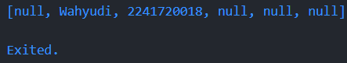
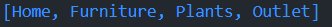
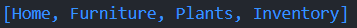
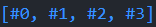

## Laporan Praktikum

### Nama: Wahyudi  
### NIM: 2241720018  
### Kelas: 3C  

---

# Tugas Pemrograman Mobile Jobsheet 4

## Daftar Isi
1. [Praktikum 1](#praktikum-1)
2. [Praktikum 2](#praktikum-2)
3. [Praktikum 3](#praktikum-3)
4. [Praktikum 4](#praktikum-4)
5. [Praktikum 5](#praktikum-5)
6. [Tugas](#tugas)

---

## Praktikum 1
#### Langkah 1:
Ketik atau salin kode program berikut ke dalam fungsi main().
```dart
var list = [1, 2, 3];
assert(list.length == 3);
assert(list[1] == 2);
print(list.length);
print(list[1]);

list[1] = 1;
assert(list[1] == 1);
print(list[1]);
```
#### Langkah 2:
Silakan coba eksekusi (Run) kode pada langkah 1 tersebut. Apa yang terjadi? Jelaskan!

**Jawaban:** 

Kode ini menunjukkan bagaimana manipulasi elemen list di Dart dilakukan dan menggunakan `assert` untuk memastikan kondisi yang diharapkan pada list. Hasil outputnya sebagai berikut:

1. `print(list.length);`  
   Menampilkan panjang list, yaitu `3`. Ini terjadi setelah pengecekan `assert(list.length == 3);` yang memastikan panjang list adalah 3.

2. `print(list[1]);`  
   Menampilkan nilai elemen pada indeks 1 sebelum diubah, yaitu `2`. Nilai ini berasal dari deklarasi awal `var list = [1, 2, 3];`. 

3. `print(list[1]);`  
    Menampilkan nilai elemen pada indeks 1 setelah diubah oleh kode `list[1] = 1;`, yang mengubah nilai elemen di indeks 1 dari `2` menjadi `1`. Outputnya adalah `1`.

#### Langkah 3:
Ubah kode pada langkah 1 menjadi variabel final yang mempunyai index = 5 dengan default value = null. Isilah nama dan NIM Anda pada elemen index ke-1 dan ke-2. Lalu print dan capture hasilnya.

**Jawaban:** 

```dart
final List<String?> list = List.filled(6, null);
  
list[1] = 'Wahyudi'; 
list[2] = '2241720018';   
  
print(list);
```
**Hasil capture**


---

## Praktikum 2
#### Langkah 1:
Ketik atau salin kode program berikut ke dalam fungsi main().
```dart
var halogens = {'fluorine', 'chlorine', 'bromine', 'iodine', 'astatine'};
print(halogens);
```
#### Langkah 2:
Silakan coba eksekusi (Run) kode pada langkah 1 tersebut. Apa yang terjadi? Jelaskan! Lalu perbaiki jika terjadi error.

**Jawaban:** 

Ketika kode tersebut dijalankan, hasilnya akan menampilkan sekumpulan elemen yang didefinisikan dalam variabel `halogens`.

#### Langkah 3:
Tambahkan kode program berikut, lalu coba eksekusi (Run) kode Anda.
```dart
var names1 = <String>{};
Set<String> names2 = {};
var names3 = {}; 

print(names1);
print(names2);
print(names3);
```
Apa yang terjadi ? Jika terjadi error, silakan perbaiki namun tetap menggunakan ketiga variabel tersebut. Tambahkan elemen nama dan NIM Anda pada kedua variabel Set tersebut dengan dua fungsi berbeda yaitu .add() dan .addAll(). Untuk variabel Map dihapus, nanti kita coba di praktikum selanjutnya.

**Jawaban:** 

Ketika kode dijalankan, variabel `names1`, yang dideklarasikan dengan tipe `Set<String>` menggunakan notasi `<String>{}`, dan `names2`, yang dideklarasikan dengan `Set<String> {}`, akan berhasil dan dicetak sebagai set kosong `{}`. Namun, variabel `names3`, yang dideklarasikan dengan notasi `{}` tanpa tipe data spesifik, secara default akan dianggap sebagai `Map`, sehingga akan menyebabkan error saat mencoba menambahkan elemen menggunakan metode `add`, yang hanya berlaku untuk set dan bukan untuk map.

**Perbaikan** 
```dart
var names1 = <String>{};
Set<String> names2 = {};
  
names1.add('Wahyudi');
names1.add('NIM: 2241720018');
names2.addAll({'Wahyudi', 'NIM: 2241720018'});
  
print(names1);
print(names2);
```

---

## Praktikum 3
#### Langkah 1:
Ketik atau salin kode program berikut ke dalam fungsi main().
```dart
var gifts = {
  // Key:    Value
  'first': 'partridge',
  'second': 'turtledoves',
  'fifth': 1
};

var nobleGases = {
  2: 'helium',
  10: 'neon',
  18: 2,
};

print(gifts);
print(nobleGases);
```
#### Langkah 2:
Silakan coba eksekusi (Run) kode pada langkah 1 tersebut. Apa yang terjadi? Jelaskan! Lalu perbaiki jika terjadi error.

**Jawaban:** 

Ketika kode tersebut dijalankan, hasilnya akan menampilkan dua `Map`: `gifts` dan `nobleGases`. Variabel `gifts` memiliki pasangan key-value yang benar, namun value untuk kunci `'fifth'` adalah tipe `int`, sementara k lainnya adalah `String`, yang bisa mengakibatkan kebingungan karena seharusnya value dalam satu `Map` konsisten dalam tipe data. Variabel `nobleGases` juga memiliki pasangan key-value dengan tipe yang tidak konsisten, karena ada campuran antara `String` dan `int` untuk value yang seharusnya konsisten dalam satu tipe data. Untuk memperbaiki kode ini dan memastikan konsistensi tipe data, sebaiknya semua value dalam `Map` memiliki tipe data yang sama. Berikut adalah perbaikan untuk memastikan semua value adalah `String`:

#### Langkah 3:
Tambahkan kode program berikut, lalu coba eksekusi (Run) kode Anda.
```dart
var mhs1 = Map<String, String>();
gifts['first'] = 'partridge';
gifts['second'] = 'turtledoves';
gifts['fifth'] = 'golden rings';

var mhs2 = Map<int, String>();
nobleGases[2] = 'helium';
nobleGases[10] = 'neon';
nobleGases[18] = 'argon';
```
Apa yang terjadi ? Jika terjadi error, silakan perbaiki.

Tambahkan elemen nama dan NIM Anda pada tiap variabel di atas (gifts, nobleGases, mhs1, dan mhs2). Dokumentasikan hasilnya dan buat laporannya!

**Jawaban:** 

Saat menjalankan kode program Dart yang diberikan, Anda akan menghadapi kesalahan karena variabel `gifts` dan `nobleGases` belum dideklarasikan sebelumnya. Variabel `gifts` dan `nobleGases` harus dideklarasikan dan diinisialisasi sebagai `Map` sebelum digunakan. Setelah itu, tambahkan elemen `{'name': 'Wahyudi', 'NIM': '2241720018'}` pada variabel `mhs1`, dan tambahkan elemen `{1: 'Wahyudi', 2: '123456'}` pada variabel `mhs2`.

**Perbaikan** 
```dart
var gifts = {
// Key:    Value
'first': 'partridge',
'second': 'turtledoves',
'fifth': 'golden rings',
};

var nobleGases = {
2: 'helium',
10: 'neon',
18: 'argon',
};

var mhs1 = <String, String>{};
mhs1['name'] = 'Wahyudi';
mhs1['NIM'] = '123456';

var mhs2 = <int, String>{};
mhs2[1] = 'Wahyudi';
mhs2[2] = '123456';

print('gifts: $gifts');
print('nobleGases: $nobleGases');
print('mhs1: $mhs1');
print('mhs2: $mhs2');
```

---

## Praktikum 4
#### Langkah 1:
Ketik atau salin kode program berikut ke dalam fungsi main().
```dart
var list = [1, 2, 3];
var list2 = [0, ...list];
print(list1);
print(list2);
print(list2.length);
```
#### Langkah 2:
Silakan coba eksekusi (Run) kode pada langkah 1 tersebut. Apa yang terjadi? Jelaskan! Lalu perbaiki jika terjadi error.

**Jawaban:** 

Muncul error karena terdapat kesalahan penamaan variabel. Pada baris print(list1);, variabel list1 belum dideklarasikan.

**Perbaikan** 
```dart
var list = [1, 2, 3];
var list2 = [0, ...list];
print(list1);
print(list2);
print(list2.length);
```
#### Langkah 3:
Tambahkan kode program berikut, lalu coba eksekusi (Run) kode Anda.
```dart
list1 = [1, 2, null];
print(list1);
var list3 = [0, ...?list1];
print(list3.length);
```
Apa yang terjadi ? Jika terjadi error, silakan perbaiki.

**Jawaban:** 

Pada kode diatas error karena variabel list1 belum dideklarasikan dengan var atau final, sehingga perlu dideklarasikan terlebih dahulu.

**Perbaikan** 
```dart
var list1 = [1, 2, null];
print(list1);
var list3 = [0, ...?list1];
print(list3.length);
```

Tambahkan variabel list berisi NIM Anda menggunakan Spread Operators. Dokumentasikan hasilnya dan buat laporannya!

**Jawaban:** 

```dart
var nim = [2241720018];
var listWithNim = [...list, ...nim];
print('List with NIM: $listWithNim');
print('List with NIM Length: ${listWithNim.length}');
```

#### Langkah 4:
Tambahkan kode program berikut, lalu coba eksekusi (Run) kode Anda.
```dart
var nav = ['Home', 'Furniture', 'Plants', if (promoActive) 'Outlet'];
print(nav);
```
Apa yang terjadi ? Jika terjadi error, silakan perbaiki. Tunjukkan hasilnya jika variabel promoActive ketika true dan false.

**Jawaban:** 

- promoActive = true: <br>
  ' <br>
  Karena promoActive adalah true, elemen 'Outlet' ditambahkan ke dalam list nav.
- promoActive = false: <br>
   <br>
  Karena promoActive adalah true, elemen 'Outlet' tidak ditambahkan ke dalam list nav.

#### Langkah 5:
Tambahkan kode program berikut, lalu coba eksekusi (Run) kode Anda.
```dart
var nav2 = ['Home', 'Furniture', 'Plants', if (login case 'Manager') 'Inventory'];
print(nav2);
```
Apa yang terjadi ? Jika terjadi error, silakan perbaiki. Tunjukkan hasilnya jika variabel login mempunyai kondisi lain.

**Jawaban:** 

- login = Manager: <br>
   <br>
  Karena login = Manager, elemen 'Inventory' ditambahkan ke dalam list nav2.
- login = Employee: <br>
   <br>
  Karena login = Employee, elemen 'Inventory' tidak ditambahkan ke dalam list nav2.

#### Langkah 6:
Tambahkan kode program berikut, lalu coba eksekusi (Run) kode Anda.
```dart
var listOfInts = [1, 2, 3];
var listOfStrings = ['#0', for (var i in listOfInts) '#$i'];
assert(listOfStrings[1] == '#1');
print(listOfStrings);
```
Apa yang terjadi ? Jika terjadi error, silakan perbaiki. Jelaskan manfaat Collection For dan dokumentasikan hasilnya.

**Jawaban:** 

 <br>
Kode ini menggunakan Collection For, yang digunakan untuk menambahkan elemen ke dalam listOfStrings. Collection For membantu dalam membangun list yang kompleks secara lebih efisien dengan menggunakan loop dalam deklarasi list. <br>

---

## Praktikum 5
#### Langkah 1:
Ketik atau salin kode program berikut ke dalam fungsi main().
```dart
var record = ('first', a: 2, b: true, 'last');
print(record)
```
#### Langkah 2:
Silakan coba eksekusi (Run) kode pada langkah 1 tersebut. Apa yang terjadi? Jelaskan! Lalu perbaiki jika terjadi error.

**Jawaban:** 
Menampilkan record yang sudah di inisialisasi

#### Langkah 3:
Tambahkan kode program berikut di luar scope void main(), lalu coba eksekusi (Run) kode Anda.
```dart
(int, int) tukar((int, int) record) {
  var (a, b) = record;
  return (b, a);
}
```
Apa yang terjadi ? Jika terjadi error, silakan perbaiki. Gunakan fungsi tukar() di dalam main() sehingga tampak jelas proses pertukaran value field di dalam Records.
**Jawaban:** 
program akan berhasil mengakses nilai a dan b dari record, dan kemudian menukarnya menggunakan fungsi tukar(), sehingga hasil yang dicetak akan menunjukkan nilai yang telah ditukar.

### langkah 4
Tambahkan kode program berikut di dalam scope void main(), lalu coba eksekusi (Run) kode Anda.
```dart
(String, int) mahasiswa;
print(mahasiswa);
```
Apa yang terjadi ? Jika terjadi error, silakan perbaiki. Inisialisasi field nama dan NIM Anda pada variabel record mahasiswa di atas. Dokumentasikan hasilnya dan buat laporannya!

**Jawaban**
Menginisialisasi mahasiswa dengan nama dan NIM 
**Perbaikan**
```dart
(String, int) mahasiswa = ("Wahyudi", 2241720018);
print(mahasiswa);
``` 

### langkah 5
Tambahkan kode program berikut di dalam scope void main(), lalu coba eksekusi (Run) kode Anda.
```dart
var mahasiswa2 = ('first', a: 2, b: true, 'last');

print(mahasiswa2.$1);
print(mahasiswa2.a); 
print(mahasiswa2.b); 
print(mahasiswa2.$2);
```
Apa yang terjadi ? Jika terjadi error, silakan perbaiki. Gantilah salah satu isi record dengan nama dan NIM Anda, lalu dokumentasikan hasilnya dan buat laporannya!

**Jawaban**
Menginisialisasi mahasiswa dengan nama dan NIM 
**Perbaikan**
```dart
var mahasiswa2 = (first: 'Wahyudi', a: 2241720018, b: true, last: 'Wahyudi');

print(mahasiswa2.first); 
print(mahasiswa2.a);    
print(mahasiswa2.b);   
print(mahasiswa2.last);  
``` 

---

# Tugas
2. Jelaskan yang dimaksud Functions dalam bahasa Dart!

**Jawaban:**

Dalam bahasa Dart, Functions adalah blok kode yang dapat dipanggil untuk menjalankan tugas tertentu. Sebuah fungsi dapat menerima input (disebut parameter) dan mengembalikan output (disebut return value). Fungsi digunakan untuk mengorganisasi kode agar lebih modular, sehingga lebih mudah dibaca, dipelihara, dan digunakan kembali.

Contoh:
```dart
double hitungLuasLingkaran(double jariJari) {
  return 3.14 * jariJari * jariJari;
}

void main() {
  double jariJari = 7.0;
  double luas = hitungLuasLingkaran(jariJari);
  print("Luas lingkaran dengan jari-jari $jariJari adalah $luas"); 
}
``` 

3. Jelaskan jenis-jenis parameter di Functions beserta contoh sintaksnya!

**Jawaban:**

Berikut adalah jenis parameter di Functions beserta contoh sintaksnya:

- **Positional Parameters** parameter yang harus diberikan secara berurutan saat memanggil fungsi. Jika tidak diberikan, maka akan menghasilkan error.

Contoh:
```dart
void cetakNama(String nama, int umur) {
  print("Nama: $nama, Umur: $umur");
}

void main() {
  cetakNama("Wahyudi", 20); 
}
```
- **Optional Positional Parameters** adalah parameter yang tidak wajib diberikan ketika fungsi dipanggil. Jika parameter ini tidak diisi, maka nilainya akan dianggap `null` (atau bisa diberikan nilai default).

Contoh:
```dart
void cetakNama(String nama, [int? umur]) {
  if (umur != null) {
    print("Nama: $nama, Umur: $umur");
  } else {
    print("Nama: $nama, Umur tidak diberikan");
  }
}

void main() {
  cetakNama("Wahyudi");
  cetakNama("Wahyudi", 20); 
}
```

- **Named Parameters** adalah parameter yang harus diberikan dengan nama parameternya saat fungsi dipanggil, sehingga urutannya tidak penting. Named parameters sering digunakan untuk meningkatkan keterbacaan kode.

Contoh:
```dart
void buatProfil({required String nama, int? umur, String? alamat}) {
  print("Nama: $nama");
  if (umur != null) {
    print("Umur: $umur");
  }
  if (alamat != null) {
    print("Alamat: $alamat");
  }
}

void main() {
  buatProfil(nama: "Wahyudi", umur: 20, alamat: "Malang");
}
```

- **Default Parameters** memberikan nilai bawaan (default) untuk parameter, sehingga jika parameter tidak diberikan saat fungsi dipanggil, maka fungsi akan menggunakan nilai default tersebut.

Contoh:
```dart
void sapaPengguna(String nama, {String sapaan = "Halo"}) {
  print("$sapaan, $nama!");
}

void main() {
  sapaPengguna("Wahyudi"); 
  sapaPengguna("Wahyudi", sapaan: "Selamat datang"); 
}
```

- Dalam contoh ini, parameter `sapaan` memiliki nilai default `"Halo"`. Jika tidak diberikan nilai saat fungsi dipanggil, maka nilai default akan digunakan.

4. Jelaskan maksud Functions sebagai first-class objects beserta contoh sintaknya!

**Jawaban:**

Dalam Dart, Functions sebagai first-class objects berarti bahwa fungsi diperlakukan seperti objek lainnya, sehingga bisa disimpan dalam variabel, dikirim sebagai parameter ke fungsi lain, dikembalikan dari fungsi, atau disimpan dalam struktur data seperti list atau map. Ini memberi fleksibilitas tinggi dalam penggunaan fungsi.

Contoh:
```dart
void tambah(int a, int b) {
  print(a + b);
}

void kali(int a, int b) {
  print(a * b);
}

void main() {
  var operasi = [tambah, kali];  
  operasi[0](3, 4);  
  operasi[1](3, 4);  
}
```
5. Apa itu Anonymous Functions? Jelaskan dan berikan contohnya!

**Jawaban:**
Anonymous Functions adalah fungsi tanpa nama yang dapat didefinisikan langsung di tempat fungsi tersebut digunakan. Anonymous functions sering digunakan saat fungsi hanya diperlukan sekali, atau ketika kita ingin menulis fungsi singkat dan sederhana tanpa harus memberikan nama khusus.

Contoh:
```dart
void main() {
  var angka = [1, 2, 3, 4];
  
  angka.forEach((item) {
    print(item * 2); 
  });
}
```

6. Jelaskan perbedaan Lexical scope dan Lexical closures! Berikan contohnya!

**Jawaban:**
- **Lexical scope** adalah aturan di mana sebuah fungsi dapat mengakses variabel berdasarkan di mana fungsi tersebut didefinisikan, bukan di mana fungsi tersebut dipanggil. Dengan kata lain, lingkup (scope) ditentukan oleh posisi kode dalam struktur program, bukan oleh runtime (waktu eksekusi).

Dalam lexical scope, fungsi dapat mengakses variabel yang berada di dalam scope (ruang lingkup) di mana fungsi itu didefinisikan.

Contoh Lexical Scope:
```dart
void main() {
  int x = 10;

  void printX() {
    print(x);  // Bisa mengakses 'x' karena 'printX' didefinisikan dalam lingkup yang sama dengan 'x'
  }

  printX();  
}
```
- **Lexical closures** adalah fungsi yang **mengingat** lingkungan (scope) di mana ia didefinisikan, bahkan ketika fungsi tersebut dipanggil di luar lingkungan asalnya. Closure dapat "menutup" (close over) variabel yang ada di scope pada saat fungsi tersebut dideklarasikan, dan tetap menyimpan akses ke variabel-variabel tersebut setelah scope aslinya berakhir.

Closure memungkinkan sebuah fungsi untuk **mengakses** dan **mempertahankan** variabel yang dideklarasikan di luar fungsinya, bahkan setelah lingkup tempat variabel itu dideklarasikan sudah selesai dieksekusi.

Contoh Lexical Closure:
```dart
Function buatPenambah(int awal) {
  int nilai = awal;

  return (int penambah) {
    nilai += penambah;
    return nilai;
  };
}

void main() {
  var penambah = buatPenambah(5); // Closure didefinisikan di sini 
  print(penambah(3));  
  print(penambah(2));  
}
```

7. Jelaskan dengan contoh cara membuat return multiple value di Functions!

**Jawaban:**
Berikut adalah beberapa cara umum untuk mengembalikan beberapa nilai dari fungsi di Dart:

- **Menggunakan List**
Menggunakan **List** untuk mengembalikan beberapa nilai sekaligus.

Contoh:
```dart
List<int> hitung(int a, int b) {
  int penjumlahan = a + b;
  int pengurangan = a - b;
  return [penjumlahan, pengurangan];
}

void main() {
  List<int> hasil = hitung(10, 5);
  print("Penjumlahan: ${hasil[0]}");  // Output: Penjumlahan: 15
  print("Pengurangan: ${hasil[1]}");  // Output: Pengurangan: 5
}
```

- **Menggunakan Map**
Menggunakan **Map** untuk mengembalikan beberapa nilai dengan memberikan label untuk setiap nilai.

Contoh:
```dart
Map<String, int> operasi(int a, int b) {
  int penjumlahan = a + b;
  int pengurangan = a - b;
  return {'penjumlahan': penjumlahan, 'pengurangan': pengurangan};
}

void main() {
  var hasil = operasi(10, 5);
  print("Penjumlahan: ${hasil['penjumlahan']}");  // Output: Penjumlahan: 15
  print("Pengurangan: ${hasil['pengurangan']}");  // Output: Pengurangan: 5
}
```

- **Menggunakan Class**
Jika  perlu mengembalikan lebih dari dua atau tiga nilai, atau jika nilai tersebut lebih kompleks, **class** bisa digunakan untuk mengemas beberapa nilai ke dalam satu objek.

Contoh:
```dart
class HasilOperasi {
  int penjumlahan;
  int pengurangan;

  HasilOperasi(this.penjumlahan, this.pengurangan);
}

HasilOperasi hitung(int a, int b) {
  int penjumlahan = a + b;
  int pengurangan = a - b;
  return HasilOperasi(penjumlahan, pengurangan);
}

void main() {
  HasilOperasi hasil = hitung(10, 5);
  print("Penjumlahan: ${hasil.penjumlahan}");  // Output: Penjumlahan: 15
  print("Pengurangan: ${hasil.pengurangan}");  // Output: Pengurangan: 5
}
```

- **Menggunakan Tuple-like Objects (Package)**
Dart tidak memiliki tipe tuple secara built-in, tetapi kita dapat menggunakan package eksternal seperti `tuple` untuk tujuan serupa.

Contoh (dengan package `tuple`):
```dart
import 'package:tuple/tuple.dart';

Tuple2<int, int> hitung(int a, int b) {
  int penjumlahan = a + b;
  int pengurangan = a - b;
  return Tuple2(penjumlahan, pengurangan);
}

void main() {
  var hasil = hitung(10, 5);
  print("Penjumlahan: ${hasil.item1}");  // Output: Penjumlahan: 15
  print("Pengurangan: ${hasil.item2}");  // Output: Pengurangan: 5
}
```
`tuple` dapat mengembalikan dua nilai dari fungsi. Ini cara yang efisien jika kita ingin menghindari penggunaan class hanya untuk tujuan sederhana.