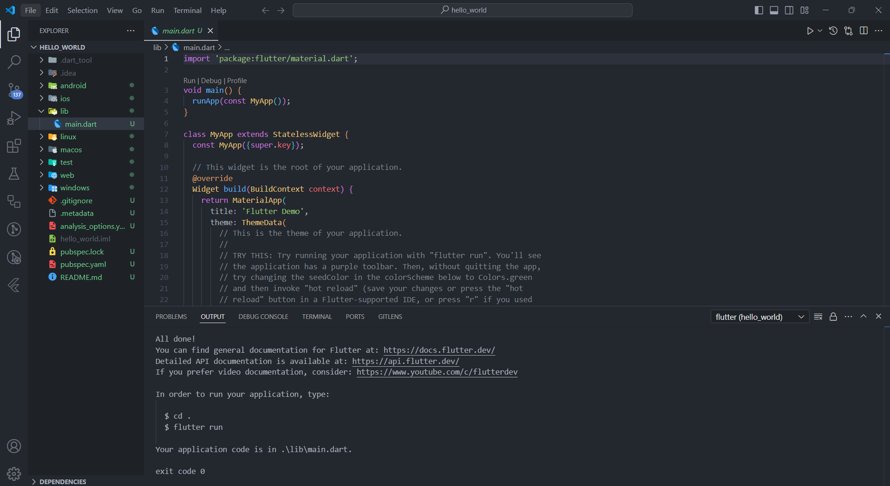
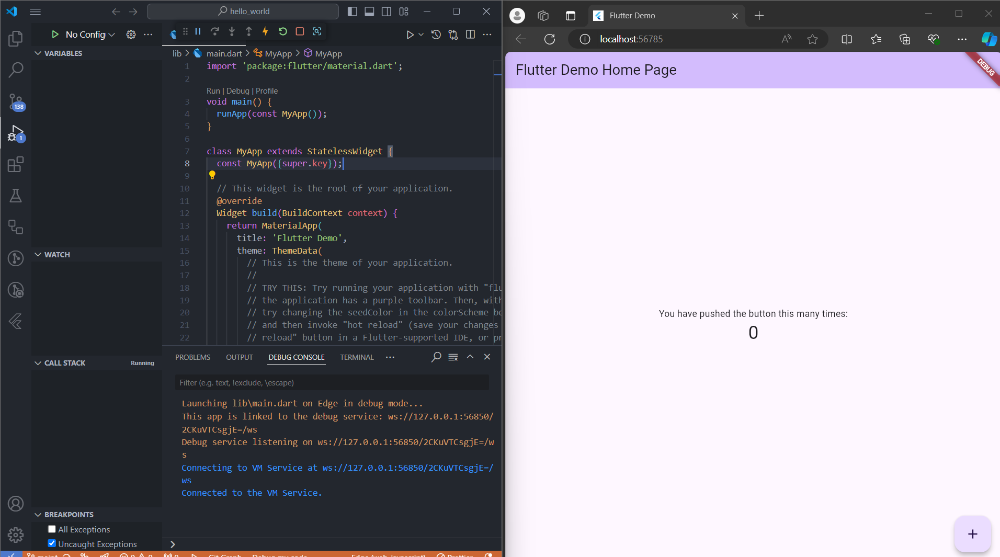
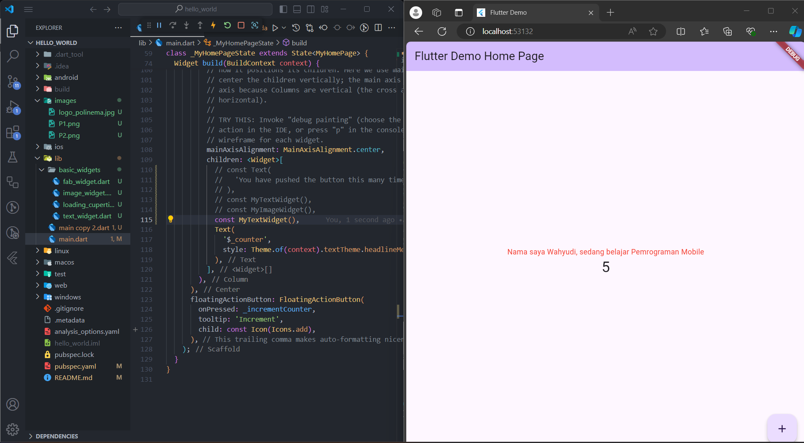
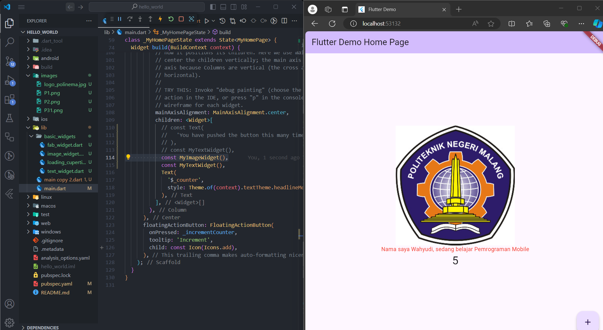
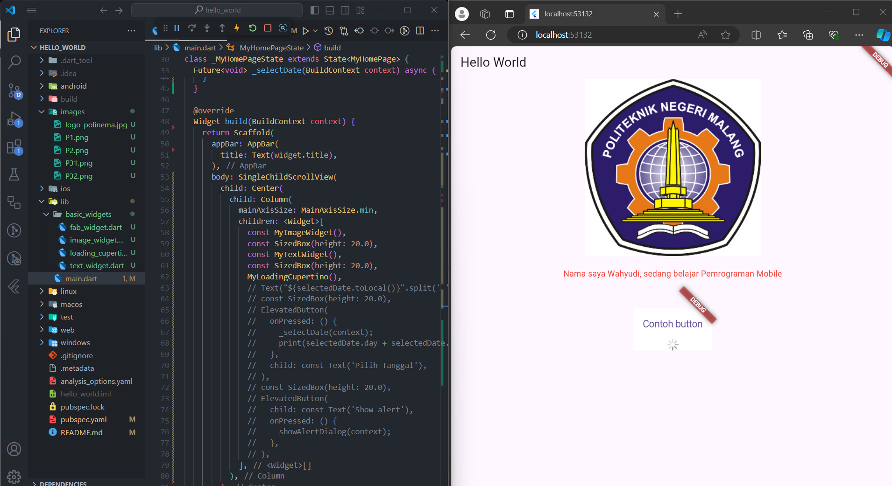
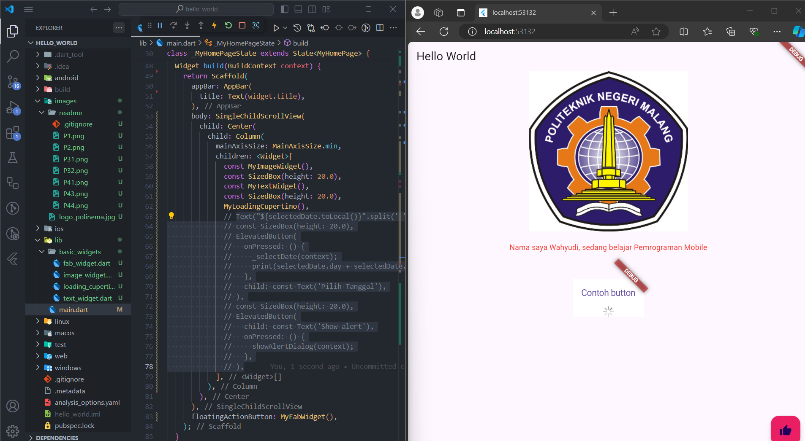
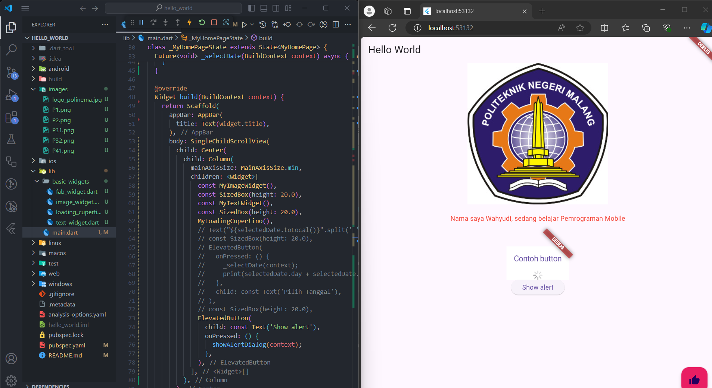
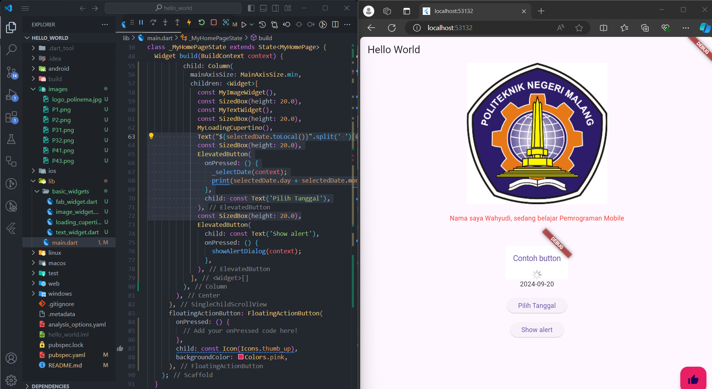

## Laporan Praktikum

### Nama: Wahyudi  
### NIM: 2241720018  
### Kelas: 3C  

---

# Tugas Pemrograman Mobile Jobsheet 5

## Daftar Isi
- [Tugas Pemrograman Mobile Jobsheet 5](#tugas-pemrograman-mobile-jobsheet-5)
  - [Daftar Isi](#daftar-isi)
  - [Praktikum 1](#praktikum-1)
  - [Praktikum 2](#praktikum-2)
  - [Praktikum 3](#praktikum-3)
  - [Praktikum 4](#praktikum-4)

---

## Praktikum 1
Telah berhasil membuat project Flutter.  

## Praktikum 2
Telah berhasil menjalankan project Flutter.  

## Praktikum 3
Telah berhasil menampilkan teks di project Flutter.  
  
Telah berhasil menampilkan gambar di project Flutter.  

## Praktikum 4
Telah berhasil menampilkan Cupertino Button dan Loading Bar di project Flutter.  
  
Telah berhasil menampilkan Floating Action Button di project Flutter.  
  
Telah berhasil menampilkan Dialog Widget di project Flutter.  
  
Telah berhasil menampilkan Date and Time Pickers di project Flutter.  

